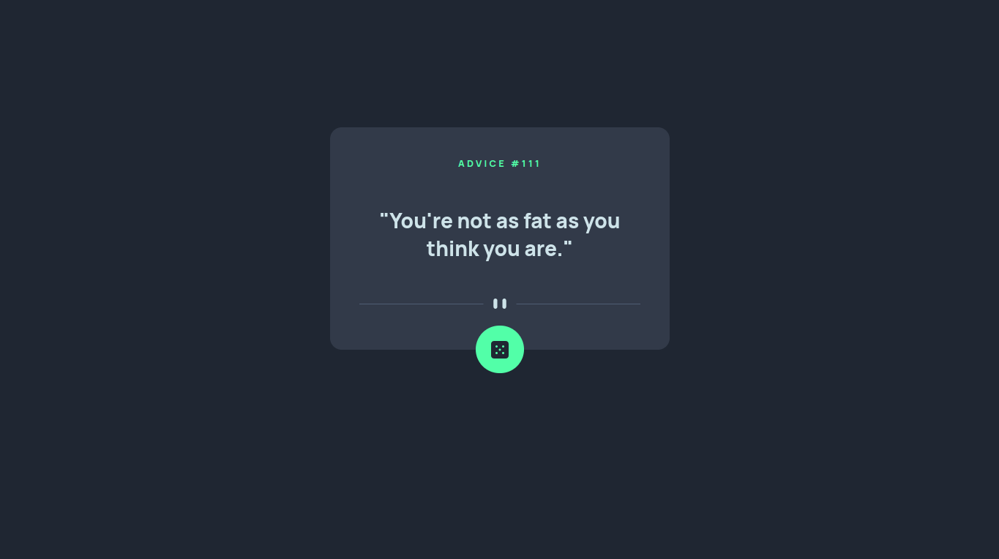
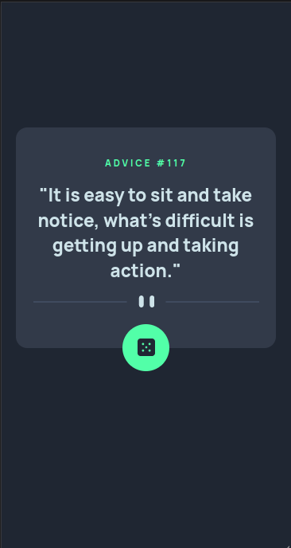

# Frontend Mentor - Advice generator app solution

## Overview

### The Solution

Users is able to:

- View the optimal layout for the app depending on their device's screen size
- See hover states for all interactive elements on the page
- Generate a new piece of advice by clicking the dice icon

### Screenshot

### Links
- Solution URL: [Github](https://github.com/horsirhon/advice-generator-app-main)

- Live Site URL: [Vercel](https://advice-generator-app-main-vb8a.vercel.app/)

## My process

### Built with

- Semantic HTML5 markup
- CSS variables
- CSS animations
- Flexbox
- Mobile-first workflow
- JavaScript DOM manipulation
- JavaScript Fetch API

### What I learned

Practiced the use Asynchronous JavaScript, Fetch API, DOM manipulation and CSS animations with this project.

### Continued development

Plan to take up more projects that require different JavaScript concepts before moving to libraries like jQuery, React or Angular.

### Useful resources

- [JavaScript Fetch API](https://www.javascripttutorial.net/javascript-fetch-api/)

## Author

- Frontend Mentor - [@horsirhon](https://www.frontendmentor.io/profile/horsirhon)

- Github - [@horsirhon](https://github.com/horsirhon)
